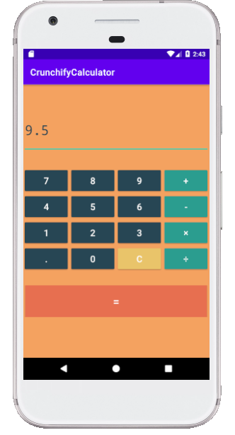
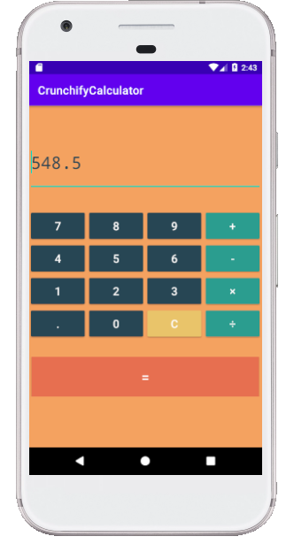

# Práctica 6: Proyecto Android e Interfaz Gráfica
## CrunchifyCalculator
**Objetivo**:

Entender conceptos relacionados a la implementación de aplicaciones con interfaz gráfica en Android y Java.

**Actividades**:

- Crear un Proyecto Android Studio "CrunchifyCalculator" en base a el siguiente Tutorial: https://crunchify.com/how-to-create-simple-calculator-android-app-using-android-studio/
- Crear Interfaz
- Crear Activities
- Ejecutar el Proyecto

## **Evidencias de ejecución**

**Ejemplo de suma: 9.5 + 539 = 548.5**

**Ejemplo de división: 83 / 4 = 20.75**

